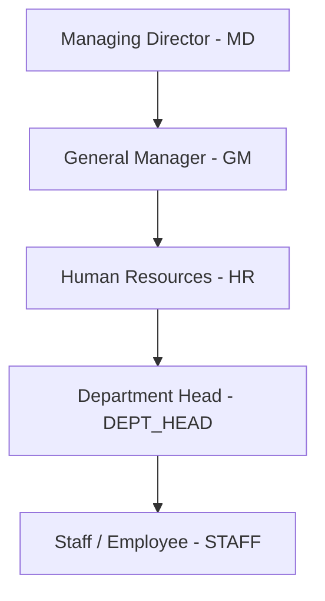

# AEC Group HR & Payroll Super App — Technical Architecture & System Documentation

## 1. Executive Summary & Architecture Overview
The **AEC Group HR & Payroll Super App** is an enterprise-grade, monolithic Django web application designed to unify Human Resources, Attendance Tracking, Payroll Management, Asset Management, Communications, Reimbursement Processing, and Task Delegation across all six distinct business units of the AEC Group:
- **AEC Cinemas**
- **Bytes Caffe**
- **AEC Residency**
- **AEC Studies**
- **AEC Institute** (IELTS & Data Science Training)
- **AEC Pixcell**

The architecture follows a strict **Department-First Modular Design** combined with **Role-Based Access Control (RBAC)**. Every transaction, report, and approval workflow is automatically segregated by department and validated against the active user's hierarchical authority.

---

## 2. Role-Based Access Control (RBAC) Hierarchy
The system utilizes a multi-tiered authorization hierarchy defined in `core.models.User.Role`:



### Role Permissions Breakdown:
1. **Managing Director (MD)**: Top-tier executive authority. Full read/write access to all departments, global payroll oversight, final reimbursement approvals, and company-wide task delegation. Operating in a streamlined executive mode, personal claim submission forms are hidden to maintain a pure reporting dashboard.
2. **General Manager (GM)**: Executive operational authority immediately under MD. Capable of heading departments, reviewing department-wise attendance, assigning tasks across units, and overseeing operational compliance.
3. **Human Resources (HR)**: Administrative core. Manages candidate onboarding, offer letters, profile verification, leave tracking, preliminary reimbursement verification, company-wide announcement postings, and payroll generation.
4. **Department Head (DEPT_HEAD)**: Operational leaders. Authorized to approve departmental leave requests, view departmental work logs, assign staff tasks within their unit, and monitor daily attendance.
5. **Staff (STAFF)**: Self-service employees. Authorized to log daily work, check-in via GPS geofencing, request leaves, submit expense claims with bill uploads, update task progress, and send congratulatory wishes on the announcement board.

---

## 3. Core Modules & End-to-End Workflows

### 3.1 Candidate Onboarding & Verification Workflow
```
[HR Admin] -> Generates Link -> [Candidate Email] -> Submits Details/Doc -> [HR Inbox] -> Verifies & Creates Profile
```
- **Link Generation**: HR inputs email in `Invite Candidate` card. Candidate receives a secure tokenized link.
- **Form Submission**: Candidate completes personal profile, uploads documents, and captures live photo.
- **Verification**: HR clicks `Verify` in the Onboarding Hub, which migrates candidate data into a permanent `EmployeeProfile`.

---

### 3.2 Attendance & GPS Geofencing Workflow
```
[Staff Device] -> Captures GPS Coords -> Matches Department Radius (100m) -> Records Present/Late Status
```
- **Geofence Enforcement**: System compares staff GPS coordinates against `Department.latitude` and `Department.longitude` with a configurable 100-meter radius.
- **Late Penalties**: Automated deduction rules apply if check-in exceeds grace periods (except for exempt departments like Cinemas).

---

### 3.3 Expense Reimbursement Workflow
```
[Staff Submits Claim + Bill Upload] (PENDING) 
       ↓
[HR Verifies Claim] (HR_VERIFIED) 
       ↓
[MD Approves/Rejects] (APPROVED / REJECTED)
```
- **Department-Wise Tracking**: HR and MD view reimbursement requests categorized strictly by department.
- **Executive Monthly Expenditure**: MD dashboard features a top-level financial summary card displaying total monthly spend and department breakdowns.

---

### 3.4 Task Delegation Workflow
```
[Manager / HR / MD Assigns Task] -> [Instant Notification] -> [Staff Updates Progress: Pending / In Progress / Completed]
```
- **Searchable Autocomplete**: Managers select staff using an interactive Alpine.js autocomplete component.
- **Real-Time Reporting**: Managers track department-wide task completion metrics instantly.

---

## 4. Technology Stack & Security
- **Core Framework**: Django 4+ (Python)
- **Database**: PostgreSQL (via Neon / dj-database-url)
- **Frontend**: TailwindCSS (Vanilla Utility), Alpine.js (Reactivity & Modals), Mermaid.js (Data Visualization)
- **Security**: WSGI CSRF protection, secure HTTP header parsing, tokenized onboarding expiration.
